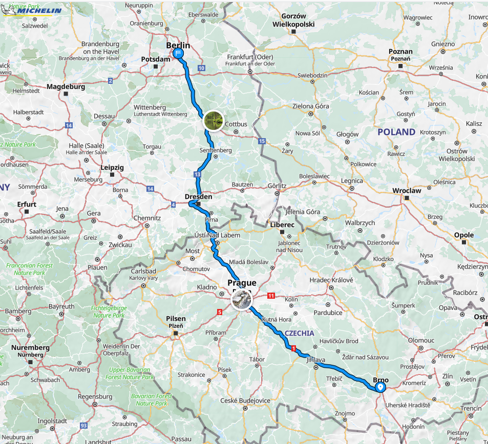
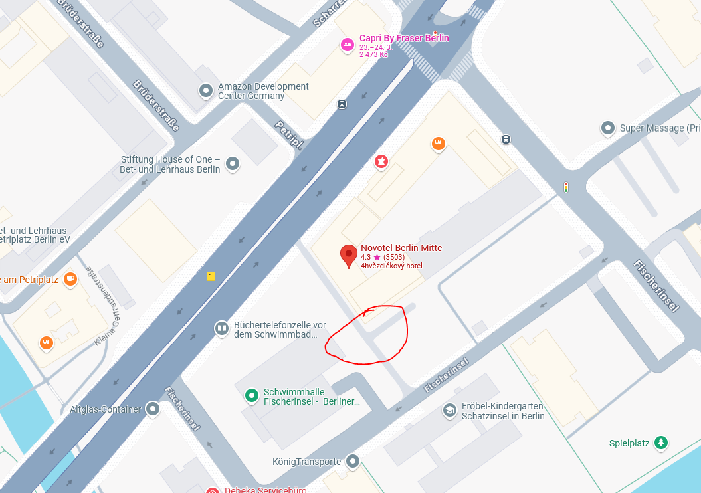
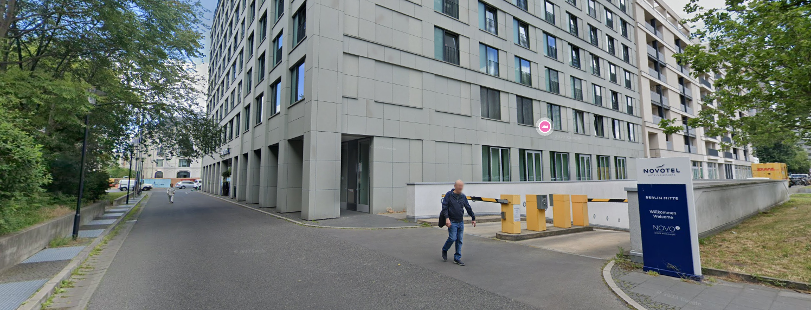
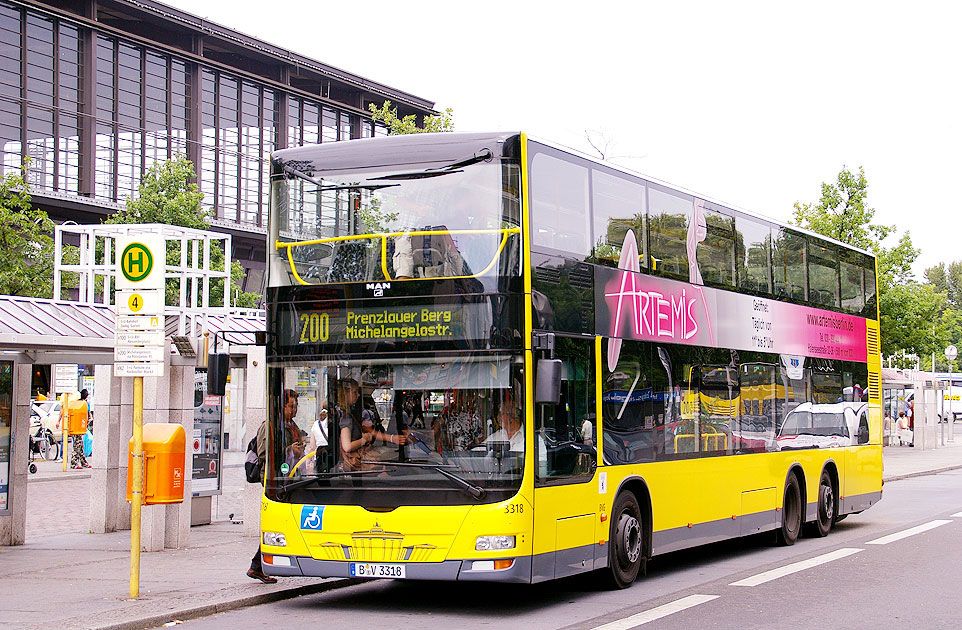
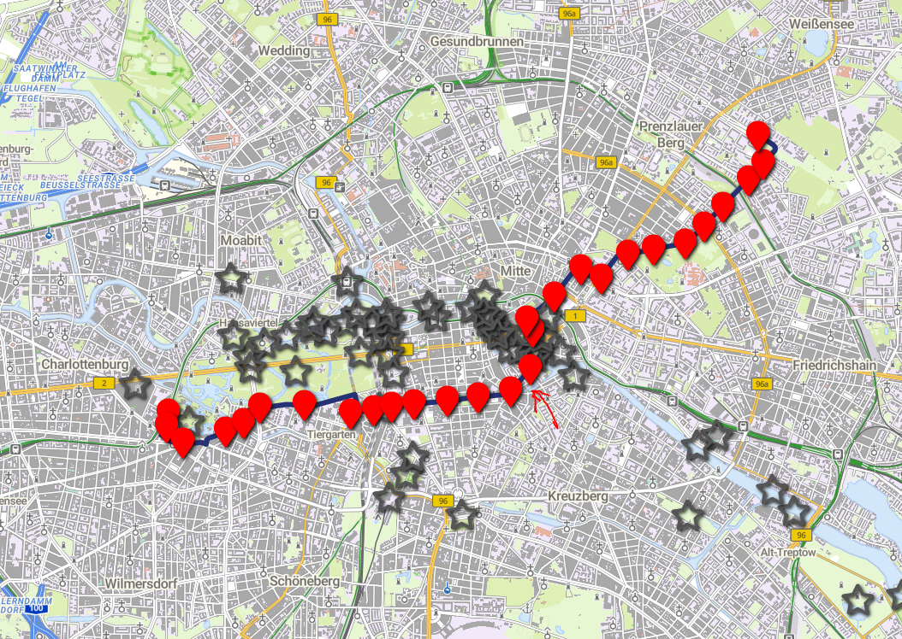
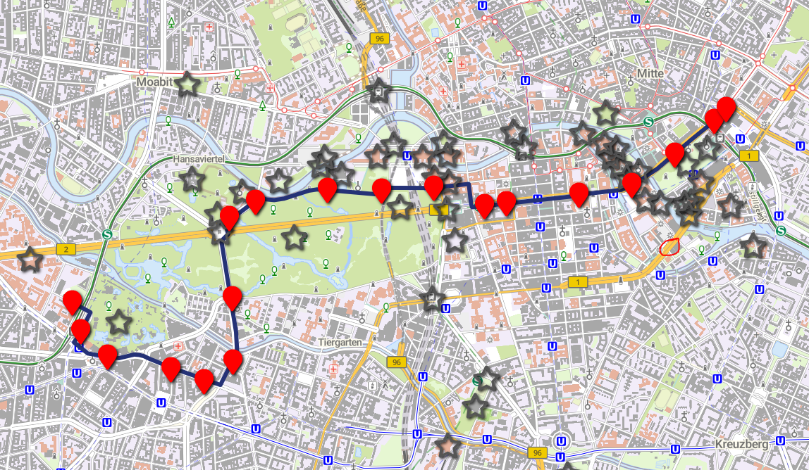
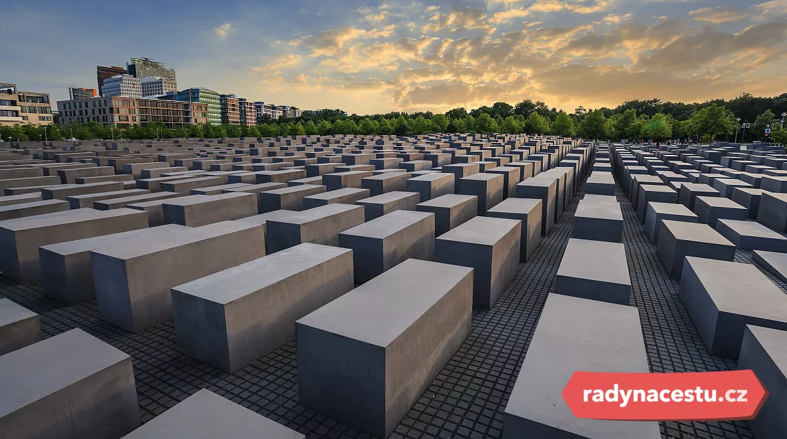
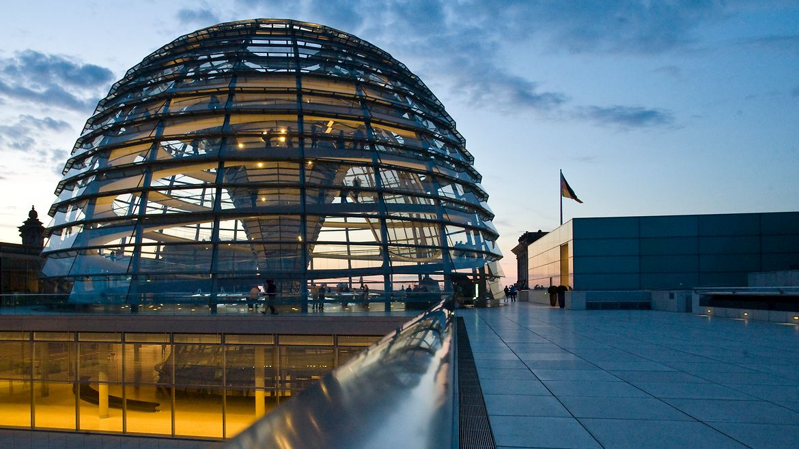
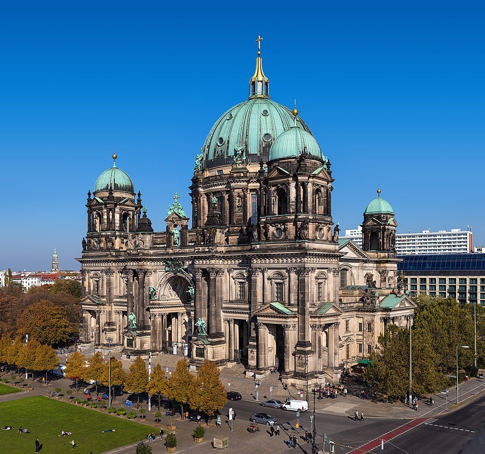

Vítejte v našem plánu na rodinný víkend v Berlíně! 🇩🇪✨

Naplánoval jsem dvoudenní výlet do Berlína tak, aby si ho užily nejen dospělí, ale i děti. Čeká nás kombinace historie, ikonických památek, zábavy pro děti, zvířat a samozřejmě i skvělého jídla - protože návštěva Berlína by nebyla kompletní bez currywurstu nebo proslulého gemüse kebabu! 🌭🥙

Program je sestavený tak, aby byl pestrý a vyvážený - uvidíme slavná místa, která by měl každý návštěvník Berlína zažít, ale zároveň nechybí čas na odpočinek, zábavu a objevování města i z dětského pohledu.

👉 Podívejte se na plán a těšte se na nezapomenutelný březnový víkend plný zážitků! 🚆🏙️

[Mapa plánu](https://www.google.com/maps/d/edit?mid=13g1t5BL-9ncHHSVOcjmW0x1K_9TAPiI&usp=sharing)

---

- [Co zařídit před odjezdem](#co-zařídit-před-odjezdem)
  - [Ekologická plaketa](#ekologická-plaketa)
  - [Jak jí opatřit](#jak-jí-opatřit)
    - [Nákup online](#nákup-online)
    - [Na vybraných místech](#na-vybraných-místech)
- [Cesta](#cesta)
- [Hotel](#hotel)
  - [Adresa](#adresa)
  - [Garáže](#garáže)
  - [Doprava v Berlíně](#doprava-v-berlíně)
    - [Linky 100 a 200](#linky-100-a-200)
- [Den první](#den-první)
  - [Potsdamer Platz](#potsdamer-platz)
  - [Německé muzeum špionáže](#německé-muzeum-špionáže)
  - [Panoramapunkt Berlin](#panoramapunkt-berlin)
  - [Židovský památník](#židovský-památník)
  - [Brandenburská brána](#brandenburská-brána)
  - [Říšský sněm](#říšský-sněm)
  - [Bellevue Palace, vítězný sloup](#bellevue-palace-vítězný-sloup)
- [Den druhý](#den-druhý)
  - [Oberbaumbrücke](#oberbaumbrücke)
  - [Museum berlinské zdi](#museum-berlinské-zdi)
  - [Alexander platz](#alexander-platz)
  - [Panorama Terrasse Park Inn](#panorama-terrasse-park-inn)
  - [Illuseum Berlin a DDR Museum](#illuseum-berlin-a-ddr-museum)
  - [Berlínský dóm](#berlínský-dóm)
- [Muzea a další místa](#muzea-a-další-místa)
  - [Muzea na ostrově](#muzea-na-ostrově)
  - [Balloon Museum, Pop Air Berlin](#balloon-museum--pop-air-berlin)
  - [Checkpoint Charlie](#checkpoint-charlie)
  - [Muzeum nechutného jídla](#muzeum-nechutného-jídla)

---

# Co zařídit před odjezdem

## Ekologická plaketa

Ekoplaketa (Umweltplakette) je povinná pro vjezd do tzv. nízkoemisních zón (Umweltzonen) v německých městech, včetně Berlína. Jedná se o nálepku na čelní sklo, která označuje emisní třídu vozidla a určuje, zda smí do těchto zón vjet.

Více informací [na stránkách dekra.cz](https://dekra.cz/stk-sme-sluzby-pro-motoristy/ekologicke-plakety/ekologicke-plakety-nemecko/).

## Jak jí opatřit

**Pro nákup ekoplakety vždy potřebujete s sebou malý i velký technický průkaz!**

### Nákup online

[Dekra eshop](https://eshop.dekra.cz/shop/ecos) - zde lze objednat **zelená** ekologická plaketa. Cena 400Kč + poštovné. Budete potřebovat vyplnit RZ, VIN a ofotit velký techničák. Můžete tak 7 dní čekat na doručení.

### Na vybraných místech

[Dekra - distribuční místa](https://dekra.cz/stk-sme-sluzby-pro-motoristy/vyhledat-stk-sme/vypis/?ep=nemecko) - nebo se můžete zastavit na některém distribučním místě. Cena tady bude pouze 350Kč, ale potřebujete s sebou opět technický průkaz.

V Brně jsou to STKčka na:
- Olomoucká 1283/156c
- Opavská 8
- Vídeňská 267/106dS
- Sladkovského 7

Vyřízení na počkání a i vám RZ na nálepku natisknou.

---

# Cesta

Pro většinu bude výchozí bod Brno. Z toho tedy vycházejí následující doporučené odjezdové hodnoty:

Délka trasy: **550 km**

Čas na cestě: **5h 30min**

Čas odjezdu: **05:00**

Čas příjezdu (odhadovaný): **11:00 - 11:30**

Doporučovaná trasa:
- D1 do Prahy
- D8 do Ústí
- A17 na Drážďany
- A13 na Berlín

---

# Hotel

Rezervace v hotelu **Novotel Berlin Mitte**

**Check-in je od 15:00**, ale je domluvené, že když přijedeme dříve (což bych preferoval), tak nám zjistí, jestli jsou pokoje připravené a můžeme se ubytovat. Pokud pokoje připravené nebudou, tak můžeme nechat auta v jejich garáži a ubytovat se později.

## Adresa

Fischerinsel 12, 10179 Berlin, Německo 
Tel: +49 302 067 40 
GC74+63 Berlín, Německo

<iframe src="https://www.google.com/maps/embed?pb=!1m18!1m12!1m3!1d607.0316749295191!2d13.40448822858203!3d52.513046114417044!2m3!1f0!2f0!3f0!3m2!1i1024!2i768!4f13.1!3m3!1m2!1s0x47a84e27a1069947%3A0xbce682803778200a!2sNovotel%20Berlin%20Mitte!5e0!3m2!1scs!2scz!4v1738612465441!5m2!1scs!2scz" width="832" height="450" style="border:0;" allowfullscreen="" loading="lazy" referrerpolicy="no-referrer-when-downgrade"></iframe>

## Garáže

- Max výška v garáži je **1,9m**
- GPS: 52°30'45.9"N 13°24'19.0"E
- Plus code: GC74+34R Berlín, Německo
- [Google maps https://maps.app.goo.gl/Z4QdkaQyYLAt89xA6](https://maps.app.goo.gl/Z4QdkaQyYLAt89xA6)

---

## Doprava v Berlíně

Doporučuji v Berlíně nechat auto v garáži a dopravovat se pomocí MHD. Na místo nákupu jednotlivých jízdenek na konkrétní jízdů bych doporučil pořídit [**Berlin WelcomeCard**](https://www.berlin-welcomecard.de/en).

Součástí karty je neomezený transport MHD, jak metro, tramvaje, autobusy a asi i lodí po řece tak slevy na vstup do 170 míst.

Kartu stačí mít pouze dospělý, děti od 3-14 let cestují zadarmo.

Nejlevnější varianta karty **Classic** je na **48 hodin** a vychází na 26,90 € pro zóny AB, které nám plně stačí.

Zakoupit můžete [zde](https://www.berlin-welcomecard.de/en/ticket-configurator?variant=25&duration=36).

Vyberete:
- Classic
- 48 hrs
- Tariff area AB
- od 15.3.2025, čas třeba 12:00PM (poledne)
- doručit E-Mailem
- počet dospělých

Výhoda této karty je, že nemusíme přemýšlet nad dalšími apkami nebo nákupem jízdenek.

Pro srovnání jeden "Einzelfahrschein" pro dospělého na zóny AB s 2hodinovou platností stojí 3,80 € a dítě 2,40 €. Je ještě varianta pro krátké trasy bez přestupu "Kurzstrecke", 3 zastávky metra nebo vlaku nebo 6 zastávek tramvaje, busu za 2,60 € (dítě 2 €).

### Linky 100 a 200

Určitě se bude hodit, že přímo před naším hotelem zastavuje autobusová **linka 200** (šipka v mapě) což je linka, která se dá skvěle použít pro "sightseeing", jelikož vede přes zajímavá místa, která máme i my v plánu navštívit.

Navíc na těchto linkách lze jet i tzv. Doppeldeckerbusse (doubble-decker).

#### Bus 200

[Více o lince 200](https://www.berlin.de/en/tourism/self-guided-tours/5758549-8056766-explore-berlin-by-bus-200.en.html)

#### Bus 100

[Více o lince 100](https://www.berlin.de/en/tourism/self-guided-tours/5704967-8056766-explore-berlin-by-bus-100.en.html)

# Mapa

Všechny body jednotlivých dnů, kde se najíst a další zajímavosti naleznete na mapě [ZDE](https://www.google.com/maps/d/edit?mid=13g1t5BL-9ncHHSVOcjmW0x1K_9TAPiI&usp=sharing).

---

# Den první

## Potsdamer Platz

[Postupimské náměstí (Potsdamer Platz)](https://cs.wikipedia.org/wiki/Postupimsk%C3%A9_n%C3%A1m%C4%9Bst%C3%AD) leží ve středu Berlína na někdejší hranici Západního a Východního Berlína.

Je součástí nového centra Berlína, které tvoří soubor bloků budov táhnoucích se od náměstí Potsdamer Platz až po Berlínskou filharmonii a Kulturforum. V 90. letech 20. století se Potsdamer Platz stalo největším staveništěm Evropy.

Zde na nás čekají 2 atrakce:
 - [Německé muzeum špionáže](#německé-muzeum-špionáže)
 - [Panoramapunkt Berlin](#panoramapunkt-berlin)

Kdo bude mít hlad, kousek je velké nákupní centrum s food courtem.

Kudy: autobus 200 ze zastávky *Fischerinsel*, směr *S+U Zoologischer Garten/​Jebensstr.*, cílová zastávka *S+U Potsdamer Platz Bhf*.

## Topografie teroru

Co: [Topography of Terror](https://www.topographie.de/en/)

Moderní centrum na místě bývalého ústředí gestapa dokumentující hrůzy nacismu.

Můžeme pouze venku prohlédnout zbytky zdi a galerii nebo i zdarma navštívit expozice týkající se Gestapa, SS, dalších výstav.

## Německé muzeum špionáže

Co: [Německé muzeum špionáže](https://www.deutsches-spionagemuseum.de/en)

Německé muzeum Spy Berlin otevřelo své dveře v září 2015. Tím, více než 25 let po skončení studené války, se hlavní město špionů dostane výstavu o temnotě špionáže, dlouho zpožděné.

Trvalá výstava, kterou lze zažít se všemi smysly, odhaluje velkolepé tajné operace, tajemné případy špionáže a legendární špiony. Ve výstavním prostoru více než 3,000 m² (32 000 čtverečních stop) ukazuje muzeum četné vzácné exponáty z inventáře sbírky vytvořené v mnoha letech a pečlivě reprodukovaných replikami, které jsou prezentovány, podporovány multimediálními, s nejinovativnějšími a budoucnostmi pro muzea. 

Vstupenky: [Německé muzeum špionáže - vstupenky](https://www.deutsches-spionagemuseum.de/en/tickets)

Sleva na [WelcomeCard](#berlin-welcomecard), levnější online.

## Panoramapunkt Berlin

Co: [Panoramapunkt Berlin](https://panoramapunkt.de/en/home-en/)

Vyhlídka 360 stupňů na celý Berlín s kavárnou na vrcholu, ale hlavně je zde **nejrychlejší výtah v evropě**.

Vstupenky: [Panoramapunkt Berlin - vstupenky](https://panoramapunkt.de/en/tickets-en/)

Sleva na [WelcomeCard](#berlin-welcomecard), levnější online a možnost booknout na čas.

## Židovský památník

Na další zastávku to máme pouze 7 minut chůze.

Rozlehlý památník holokaustu tvořený 2710 kvádry, který připomíná bludiště a v podzemí ukrývá výstavní síň.

Co: [Židovský památník](https://www.stiftung-denkmal.de/en/)

## Brandenburská brána 

Pokračovat pěšmo na sever navštívíme jednu z dominant Berlína a tou je **Brandenburská brána**.

Co: [Brandenburská brána](https://www.stiftung-denkmal.de/en/)

## Říšský sněm

Co: [Říšský sněm](https://www.bundestag.de/cz)

Pokud bude zájem, pokusím se zařídit rezervace na prohlídku Říšského sněmu (budova Bundestag), která je zdarma, ale je třeba rezerovat.
> Máme rezervaci pro 22 lidí na sobotu 16:45 s náhradním termínem v neděli 18:15.

Asi nejzajímavější pro všechny by byla návštěva kopule (Die Kuppel). Je možné navštívit až do večerních hodin, takže se můžeme operativně domluvit. Kopule je otevřena denně od 8:00 do 24:00, poslední vstup je v 21:45 hod.

[Návštěva střešní terasy a kopule budovy Říšského sněmu](https://www.bundestag.de/cz/besuch/kuppel-inhalt-638870)
[Registrace na prohlídku Říšského sněmu](https://visite.bundestag.de/BAPWeb/pages/createBookingRequest/viewPrivacyInfo.jsf?cid=1)

## Bellevue Palace, vítězný sloup

Den můžeme zakončit buďto procházkou Tiergarden na palác Bellevue.

Co: [Bellevue Palace](https://www.bundespraesident.de/DE/amt-und-aufgaben/amtssitze/schloss-bellevue/schloss-bellevue_node.html)
a
[Vítězný sloup](https://www.berlin.de/en/attractions-and-sights/3560160-3104052-victory-column.en.html)

ale možná bych volil přejet na vyhlášený Gemüse Kebab (Ruyam).
> V mapě jako Ruyam Gemuse Kebab 2.

---

# Den druhý

## Oberbaumbrücke

Po snídani se vydáme na prohlídku Oberbaumbrücke. Po kterém přejdeme k muzeu berlínské zdi.

Oberbaumbrücke je dvoupatrový most přes berlínskou řeku Sprévu. Silueta mostu je typickým znakem města. Most spojuje dva městské obvody Friedrichshain a Kreuzberg, které byly rozděleny po roce 1961 berlínskou zdí. Obnova a znovuotevření mostu Oberbaumbrücke je jedním ze symbolů znovusjednocení Berlína. 

Co: [Oberbaumbrücke](https://cs.wikipedia.org/wiki/Oberbaumbr%C3%BCcke)

Kudy: bus 165 ze zastávky *U Märkisches Museum/Inselstr.*, směr *Köpenick, Müggelschlößchenweg*, cílová zastávka *U Schlesisches Tor*.

Před mostem je vyhlášený stánek s burgery.

## Museum berlinské zdi

Hned za mostem na pravém břehu Sprévy navštívíme muzeum berlínské zdi.
UPDATE: Muzeum není za ty peníze zase tak zajímavé, možná přeskočíme.

Co: [Museum berlinské zdi](https://thewallmuseum.com/en/)

Vstupenky: [Eshop Museum berlinské zdi](https://thewallmuseum.com/en/tickets/)

Podle stráveného času můžeme zajít na vyhlášený *Gemusekebap* [Mustafa Demir’s Gemüse Kebap](https://maps.app.goo.gl/DpWvTA9c3fmxkxtn6).

Ale spíše budeme pokračovat podél řeky a prohlédneme si [East Side Gallery](https://www.stiftung-berliner-mauer.de/de/east-side-gallery), galerie přímo na zbytcích berlínské zdi.

## Alexander platz

Dále navštívíme centrální náměstí [Alexander platz](https://cs.wikipedia.org/wiki/Alexanderplatz). Netrávil bych tady moc času, jsou tu pouze hodiny. 

Zde je možnost se opět najíst jak kebabu, currywurstu a jiného.

## Panorama Terrasse Park Inn

Výhled na Berlín, místo televizní věže, která je předražená, se dá za 6 euro vyjet na terasu hotelu Park Inn s výhledem na Berlín.

Co: [Panorama Terrasse Park Inn](https://www.parkinn-berlin.de/dachterrasse/)

## Illuseum Berlin a DDR Museum

Kolem televizní věže v blízkosti kostela svaté Marie se nacházejí dvě zajímavá muzea:
- [Illuseum Berlin](https://www.illuseum-berlin.de/tickets/?bkref=tjbg5XKkM1qzMra&utm_source=gttd)
- [DDR Museum](https://www.ddr-museum.de/en/visit)

## Berlínský dóm

Přejdeme přes řeku po Karl-Liebknecht-Brucke a dostaneme se k Berlínskému dómu, přepracovaná katedrála z 19. století. Zavírá v 5 hodin, tak je třeba vybrat.

Co: [Berlínský dóm](https://www.berlinerdom.de/en/)
[Berlínská katedrála](https://cs.wikipedia.org/wiki/Berl%C3%ADnsk%C3%A1_katedr%C3%A1la)

Sleva na Berlin Welcome Card.
[Eshop Berliner dom](https://shop.berlinerdom.de/en/Shop/Index/besichtigung/43420)

---

# Muzea a další místa

Nechám na zvážení, jestli za něco vyměnit.

## Muzea na ostrově

Určitě kdo by chtěl je možnost navštívit některé ze spousty muzeí na ostrově muzeí na kterém i bydlíme.

- [Bodeho muzeum](https://www.smb.museum/museen-einrichtungen/bode-museum/home/) - Muzeum u řeky se sochami a byzantským uměním, pravidelnými výstavami a akcemi a také obchodem.
- [Pergamonské muzeum](https://www.smb.museum/museen-einrichtungen/pergamonmuseum/home/) - **dočasně uzavřeno** - Muzejní komplex se sbírkami starověkého řeckého a římského umění a babylonskými i perskými exponáty.
- [Stará národní galerie](https://www.smb.museum/museen-einrichtungen/alte-nationalgalerie/home/) - Sbírka romantického, impresionistického a raně modernistického umění v elegantní budově se sloupořadím.
- [Nové muzeum](https://www.smb.museum/museen-einrichtungen/neues-museum/home/) - Velkolepé muzeum z 19. století se sbírkami egyptského umění a prehistorické archeologie.
- [Staré muzeum](https://www.smb.museum/museen-einrichtungen/altes-museum/home/) - Význačná neoklasicistní stavba s 18 sloupy, rotundou a výstavou římských a řeckých artefaktů.

Na tyto muzea máme přednostní vstup a slevu s Berlin Welcome card.

## Balloon Museum | Pop Air Berlin

Další možností je návštěva [Balloon Museum, Pop Air Berlin](9083S Treptower Park).

Lístky opět online na [eshop Balloon Museum, Pop Air Berlin](https://www.eventim.de/noapp/en/eventseries/3774289/?affiliate=BAJ&utm_source=BAJ&utm_medium=dp&utm_campaign=luxgermany).

Je to dražší, třeba zvážit.

## Checkpoint charlie

Pokud bycháme [Balloon Museum, Pop Air Berlin](#balloon-museum-pop-air-berlin), můžeme ke známému místu zvanému [Checkpoint Charlie](https://cs.wikipedia.org/wiki/Checkpoint_Charlie). Checkpoint Charlie byl hraniční přechod v Berlíně. Patří k nejznámějším přechodům rozděleného Berlína.

Prohlídka nebude náročná, ani dlouhá.

## Muzeum nechutného jídla

Co: [Muzeum nechutného jídla](https://disgustingfoodmuseum.berlin/)

[Eshop Muzeum nechutného jídla](https://disgustingfoodmuseum.berlin/)

Lístky na time slot a sleva na Berlin Welcome card. Asi bych spíše řešil na místě.

---