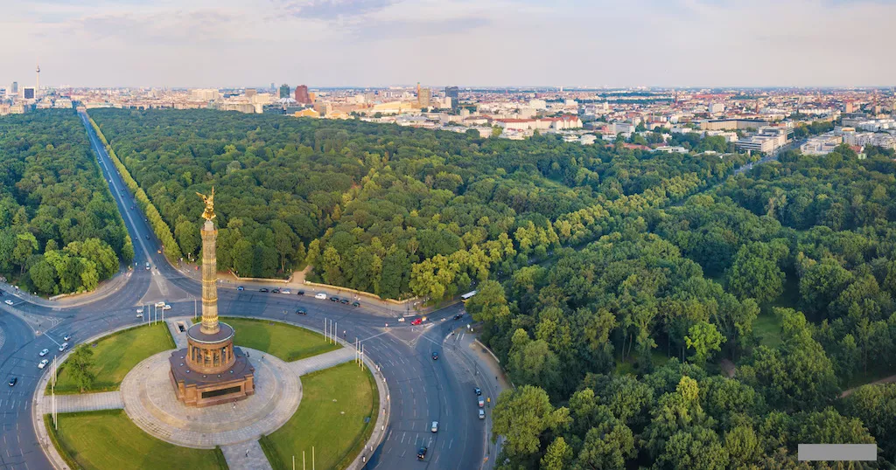

Vítejte v našem plánu na rodinný víkend v Berlíně! 🇩🇪✨

Naplánoval jsem dvoudenní výlet do Berlína tak, aby si ho užily nejen dospělí, ale i děti. Čeká nás kombinace historie, ikonických památek, zábavy pro děti, zvířat a samozřejmě i skvělého jídla - protože návštěva Berlína by nebyla kompletní bez currywurstu nebo proslulého gemüse kebabu! 🌭🥙

Program je sestavený tak, aby byl pestrý a vyvážený - uvidíme slavná místa, která by měl každý návštěvník Berlína zažít, ale zároveň nechybí čas na odpočinek, zábavu a objevování města i z dětského pohledu.

👉 Podívejte se na plán a těšte se na nezapomenutelný březnový víkend plný zážitků! 🚆🏙️

---

- [Co zařídit před odjezdem](#co-zařídit-před-odjezdem)
  - [Ekologická plaketa](#ekologická-plaketa)
  - [Jak jí opatřit](#jak-jí-opatřit)
    - [Nákup online](#nákup-online)
    - [Na vybraných místech](#na-vybraných-místech)
- [Cesta](#cesta)
- [Hotel](#hotel)
  - [Adresa](#adresa)
  - [Garáže](#garáže)
  - [Doprava v Berlíně](#doprava-v-berlíně)
    - [Linky 100 a 200](#linky-100-a-200)
- [Den první](#den-první)
  - [Aquarium Berlin](#aquarium-berlin)
  - [Vítězný sloup a tiergarden](#vítězný-sloup-a-tiergarden)
  - [Brandenburská brána a Židovský památník](#brandenburská-brána-a-židovský-památník)
  - [Říšský sněm](#říšský-sněm)
  - [Berlínský dóm](#berlínský-dóm)
  - [DDR Museum nebo Illuseum](#ddr-museum-nebo-illuseum)
- [Den druhý](#den-druhý)
  - [Museum berlinské zdi](#museum-berlinské-zdi)
  - [Balloon Museum | Pop Air Berlin](#balloon-museum--pop-air-berlin)
  - [Checkpoint Charlie](#checkpoint-charlie)
  - [Muzeum nechutného jídla](#muzeum-nechutného-jídla)
  - [Panorama Terrasse Park Inn](#panorama-terrasse-park-inn)
- [Muzea na ostrově](#muzea-na-ostrově)

---

# Co zařídit před odjezdem

## Ekologická plaketa

Ekoplaketa (Umweltplakette) je povinná pro vjezd do tzv. nízkoemisních zón (Umweltzonen) v německých městech, včetně Berlína. Jedná se o nálepku na čelní sklo, která označuje emisní třídu vozidla a určuje, zda smí do těchto zón vjet.

Více informací [na stránkách dekra.cz](https://dekra.cz/stk-sme-sluzby-pro-motoristy/ekologicke-plakety/ekologicke-plakety-nemecko/).

## Jak jí opatřit

**Pro nákup ekoplakety vždy potřebujete s sebou malý i velký technický průkaz!**

### Nákup online

[Dekra eshop](https://eshop.dekra.cz/shop/ecos) - zde lze objednat **zelená** ekologická plaketa. Cena 400Kč + poštovné. Budete potřebovat vyplnit RZ, VIN a ofotit velký techničák. Můžete tak 7 dní čekat na doručení.

### Na vybraných místech

[Dekra - distribuční místa](https://dekra.cz/stk-sme-sluzby-pro-motoristy/vyhledat-stk-sme/vypis/?ep=nemecko) - nebo se můžete zastavit na některém distribučním místě. Cena tady bude pouze 350Kč, ale potřebujete s sebou opět technický průkaz.

V Brně jsou to STKčka na:
- Olomoucká 1283/156c
- Opavská 8
- Vídeňská 267/106dS
- Sladkovského 7

Vyřízení na počkání a i vám RZ na nálepku natisknou.

---

# Cesta

Pro většinu bude výchozí bod Brno. Z toho tedy vycházejí následující doporučené odjezdové hodnoty:

Délka trasy: **550 km**
Čas na cestě: **5h 30min**
Čas odjezdu: **05:00**
Čas příjezdu (odhadovaný): **11:00 - 11:30**

Doporučovaná trasa:
- D1 do Prahy
- D8 do Ústí
- A17 na Drážďany
- A13 na Berlín

Doporučený odjezd bych navrhoval v **04:00** s plánovaným příjezdem cca **11:20**, ale s přestávkou očekávám spíše příjezd na **12:00** za všech kladných okolností.

---

# Hotel

Rezervace v hotelu **Novotel Berlin Mitte**

**Check-in je od 15:00**, ale je domluvené, že když přijedeme dříve (což bych preferoval), tak nám zjistí, jestli jsou pokoje připravené a můžeme se ubytovat. Pokud pokoje připravené nebudou, tak můžeme nechat auta v jejich garáži a ubytovat se později.

## Adresa

Fischerinsel 12, 10179 Berlin, Německo 
Tel: +49 302 067 40 
GC74+63 Berlín, Německo

<iframe src="https://www.google.com/maps/embed?pb=!1m18!1m12!1m3!1d607.0316749295191!2d13.40448822858203!3d52.513046114417044!2m3!1f0!2f0!3f0!3m2!1i1024!2i768!4f13.1!3m3!1m2!1s0x47a84e27a1069947%3A0xbce682803778200a!2sNovotel%20Berlin%20Mitte!5e0!3m2!1scs!2scz!4v1738612465441!5m2!1scs!2scz" width="832" height="450" style="border:0;" allowfullscreen="" loading="lazy" referrerpolicy="no-referrer-when-downgrade"></iframe>

## Garáže

- GPS: 52°30'45.9"N 13°24'19.0"E
- Plus code: GC74+34R Berlín, Německo
- [Google maps https://maps.app.goo.gl/Z4QdkaQyYLAt89xA6](https://maps.app.goo.gl/Z4QdkaQyYLAt89xA6)

---

## Doprava v Berlíně

Doporučuji v Berlíně nechat auto v garáži a dopravovat se pomocí MHD. Na místo nákupu jednotlivých jízdenek na konkrétní jízdů bych doporučil pořídit [**Berlin WelcomeCard**](https://www.berlin-welcomecard.de/en).

Součástí karty je neomezený transport MHD, jak metro, tramvaje, autobusy a asi i lodí po řece tak slevy na vstup do 170 míst.

Kartu stačí mít pouze dospělý, děti od 3-14 let cestují zadarmo.

Nejlevnější varianta karty **Classic** je na **48 hodin** a vychází na 26,90 € pro zóny AB, které nám plně stačí.

Zakoupit můžete [zde](https://www.berlin-welcomecard.de/en/ticket-configurator?variant=25&duration=36).

Vyberete:
- Classic
- 48 hrs
- Tariff area AB
- od 15.3.2025, čas třeba 12:00PM (poledne)
- doručit E-Mailem
- počet dospělých

Výhoda této karty je, že nemusíme přemýšlet nad dalšími apkami nebo nákupem jízdenek.

Pro srovnání jeden "Einzelfahrschein" pro dospělého na zóny AB s 2hodinovou platností stojí 3,80 € a dítě 2,40 €. Je ještě varianta pro krátké trasy bez přestupu "Kurzstrecke", 3 zastávky metra nebo vlaku nebo 6 zastávek tramvaje, busu za 2,60 € (dítě 2 €).

### Linky 100 a 200

Určitě se bude hodit, že přímo před naším hotelem zastavuje autobusová **linka 200** (šipka v mapě) což je linka, která se dá skvěle použít pro "sightseeing", jelikož vede přes zajímavá místa, která máme i my v plánu navštívit.

Navíc na těchto linkách lze jet i tzv. Doppeldeckerbusse (doubble-decker).

#### Bus 200

[Více o lince 200](https://www.berlin.de/en/tourism/self-guided-tours/5758549-8056766-explore-berlin-by-bus-200.en.html)

#### Bus 100

[Více o lince 100](https://www.berlin.de/en/tourism/self-guided-tours/5704967-8056766-explore-berlin-by-bus-100.en.html)

---

# Den první

## Aquarium Berlin

Po příjezdu na hotel nebo garáže se vydáme na první návštěvu **AQUARUIM BERLIN** v těsné blízkosti zoologické zahrady.

Co: [**AQUARUIM BERLIN**](https://www.aquarium-berlin.de/en)

Kudy:
- autobus 200 ze zastávky *Fischerinsel*, směr *S+U Zoologischer Garten/​Jebensstr.*, cílová zastávka *S+U Zoologischer Garten/Jebensstr*.

Tady si dáme k obědu první ochutnávku a to vyhlášený *Currywurst*. Poté se pěšky přesuneme do akvária (10 min.)

Je výhodné zakoupit vstupenky online předem. Je třeba vybrat 2 hodinové okno na vstup.
Měli bychom stihnout časové okno 12-14. Není to čas možný ke strávení, ale pouze pro vstup.
Čím dříve lístky objednáme, tím levnější jsou.

[AQUARIUM BERLIN ESHOP](https://shop.aquarium-berlin.de/en/article/156)

Vybíráte z prvních 3 nabídek - dospělí, děti 4-15 let a děti do 4 let.
Dále vyberete 15.3.2025 a slot 12-14.

## Vítězný sloup a tiergarden

Posuneme se na **Vítězný sloup** a do zahrad **Tiergarden**. Ikonické části berlína.

Co: [Vítězný sloup](https://www-siegessaeule--berlin-de.translate.goog/?_x_tr_sl=auto&_x_tr_tl=cs&_x_tr_hl=cs) a [Tiergarden](https://cs.wikipedia.org/wiki/Tiergarten).

Kudy: autobus 100 ze zastávky *Breitscheidplatz*, směr *S+U Alexanderplatz via Reichstag*, cílová zastávka *Großer Stern*.

Prohlídneme si vítězný sloup, je možná i prohlídka, ale nebudeme se zdržovat a budeme pěšky pokračovat zahradami Tiergarden kolem 
zámku Bellevue směrem na Brandenburskou bránu a budovu Říšského sněmu.

## Brandenburská brána a Židovský památník

Co: [Židovský památník](https://www.stiftung-denkmal.de/en/)

Co: [Brandenburská brána](https://www.stiftung-denkmal.de/en/)

## Říšský sněm

Co: [Říšský sněm](https://www.bundestag.de/cz)

Pokud bude zájem, pokusím se zařídit rezervace na prohlídku Říšského sněmu (budova Bundestag), která je zdarma, ale je třeba rezerovat.
Asi nejzajímavější pro všechny by byla návštěva kopule (Die Kuppel). Je možné navštívit až do večerních hodin, takže se můžeme operativně domluvit. Kopule je otevřena denně od 8:00 do 24:00, poslední vstup je v 21:45 hod.

[Návštěva střešní terasy a kopule budovy Říšského sněmu](https://www.bundestag.de/cz/besuch/kuppel-inhalt-638870)
[Registrace na prohlídku Říšského sněmu](https://visite.bundestag.de/BAPWeb/pages/createBookingRequest/viewPrivacyInfo.jsf?cid=1)

## Berlínský dóm

Co: [Berlínský dóm](https://www.berlinerdom.de/en/)
[Berlínská katedrála](https://cs.wikipedia.org/wiki/Berl%C3%ADnsk%C3%A1_katedr%C3%A1la)

Kudy: bus 100 ze zastávky *Reichstag/Bundestag*, směr *S+U Alexanderplatz*, cílová zastávka *U Museumsinsel* nebo metrem U5 z *Bundestag*, směr *U Hönow (Berlin)*, cílová zastávka *Museumsinsel*

Sleva na Berlin Welcome Card.
[Eshop Berliner dom](https://shop.berlinerdom.de/en/Shop/Index/besichtigung/43420)

## DDR Museum nebo Illuseum

Pokud bychom se do Reichstagu nedostali, můžeme se přesunout a vybrat si návštěvu DDR muzea nebo muzea iluzí, které jsou déle otevřené.

Co: [DDR Museum](https://www.ddrmuseum.de/en/)
Co: [Illuseum](https://www.illuseum-berlin.de/en/)

Kudy: vedle [Berlínského dóm](#berlínský-dóm)

Zde můžeme dát večeři ve schovaném bistru *Bistro Lebenswelten - Humboldt Forum* (otevřeno pouze do 19:00).
[Menu](https://humboldtforum-lebenswelten.de/wp-content/uploads/2024/04/Bistro-Karte_DT_web.pdf)

---

# Den druhý

## Museum berlinské zdi

Co: [Museum berlinské zdi](https://thewallmuseum.com/en/)

Kudy: bus 195 ze zastávky *U Märkisches Museum/Inselstr.*, směr *Köpenick, Müggelschlößchenweg*, cílová zastávka *U Schlesisches Tor* 

Po snídani vyrazíme na prohlídku zbytků berlínské zdi, která je přetvořena na galerii a můžeme navštívit muzeum. Lístky online je opět výhodnější než na místě. Můžeme koupit den předem nebo podle možností.

[Eshop Museum berlinské zdi](https://thewallmuseum.com/en/tickets/)

Podle stráveného času můžeme zajít na vyhlášený *Gemusekebap* [Mustafa Demir’s Gemüse Kebap](https://maps.app.goo.gl/DpWvTA9c3fmxkxtn6).

Kudy: tram 10, jedna zestávka z *Warschauer Straße* na *Warschauer Str.*.

## Balloon Museum | Pop Air Berlin

Další možností je návštěva [Balloon Museum | Pop Air Berlin](9083S Treptower Park (Berlin)).

Kudy: vlak S9 z *Warschauer Str.*, směr *9083S Treptower Park (Berlin)*, cílová zastávka *Treptower Park*.

Lístky opět online na [eshop Balloon Museum | Pop Air Berlin](https://www.eventim.de/noapp/en/eventseries/3774289/?affiliate=BAJ&utm_source=BAJ&utm_medium=dp&utm_campaign=luxgermany).

Je to dražší, třeba zvážit.

## Checkpoint charlie

Pokud bycháme [Balloon Museum | Pop Air Berlin](#balloon-museum-pop-air-berlin), můžeme ke známému místu zvanému [Checkpoint Charlie](https://cs.wikipedia.org/wiki/Checkpoint_Charlie). Checkpoint Charlie byl hraniční přechod v Berlíně. Patří k nejznámějším přechodům rozděleného Berlína.

Kudy: metro U5 z *Frankfurter Tor*, směr *S+U Berlin Hauptbahnhof*, přestup na *Unter den Linden* na U6, směr *U Alt-Mariendorf (Berlin)*, cílová zastávka *Kochstr.*

Prohlídka nebude náročná, ani dlouhá.

## Muzeum nechutného jídla

Co: [Muzeum nechutného jídla](https://disgustingfoodmuseum.berlin/)

Kudy: pěšky od [Checkpoint Charlie](#checkpoint-charlie).

[Eshop Muzeum nechutného jídla](https://disgustingfoodmuseum.berlin/)

Lístky na time slot a sleva na Berlin Welcome card. Asi bych spíše řešil na místě.

## Panorama Terrasse Park Inn

Výhled na Berlín, místo televizní věže, která je předražená, se dá za 6 euro vyjet na terasu hotelu Park Inn s výhledem na Berlín.

Co: [Panorama Terrasse Park Inn](https://www.parkinn-berlin.de/dachterrasse/)

Kudy: bus 200 z *U Stadtmitte*, směr *Michelangelostr. via Alexanderplatz*, cílová zastávka *S+U Alexanderplatz Bhf*.

Pod hotelem je spouste bister a občerstvení, kde se dá jít na večeři.

---

# Muzea na ostrově

Určitě kdo by chtěl je možnost navštívit některé ze spousty muzeí na ostrově muzeí na kterém i bydlíme.

- [Bodeho muzeum](https://www.smb.museum/museen-einrichtungen/bode-museum/home/) - Muzeum u řeky se sochami a byzantským uměním, pravidelnými výstavami a akcemi a také obchodem.
- [Pergamonské muzeum](https://www.smb.museum/museen-einrichtungen/pergamonmuseum/home/) - **dočasně uzavřeno** - Muzejní komplex se sbírkami starověkého řeckého a římského umění a babylonskými i perskými exponáty.
- [Stará národní galerie](https://www.smb.museum/museen-einrichtungen/alte-nationalgalerie/home/) - Sbírka romantického, impresionistického a raně modernistického umění v elegantní budově se sloupořadím.
- [Nové muzeum](https://www.smb.museum/museen-einrichtungen/neues-museum/home/) - Velkolepé muzeum z 19. století se sbírkami egyptského umění a prehistorické archeologie.
- [Staré muzeum](https://www.smb.museum/museen-einrichtungen/altes-museum/home/) - Význačná neoklasicistní stavba s 18 sloupy, rotundou a výstavou římských a řeckých artefaktů.

Na tyto muzea máme přednostní vstup a slevu s Berlin Welcome card.