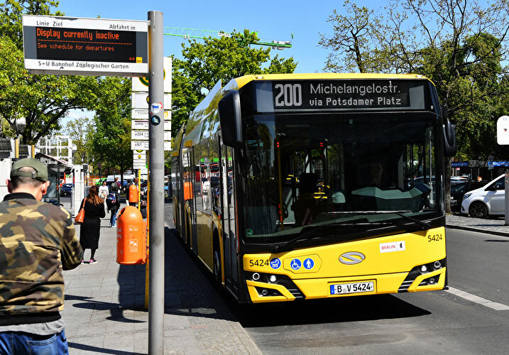
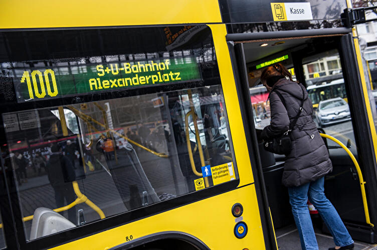

Vítejte v našem plánu na rodinný víkend v Berlíně! 🇩🇪✨

Naplánoval jsem dvoudenní výlet do Berlína tak, aby si ho užily nejen dospělí, ale i děti. Čeká nás kombinace historie, ikonických památek, zábavy pro děti, zvířat a samozřejmě i skvělého jídla - protože návštěva Berlína by nebyla kompletní bez currywurstu nebo proslulého gemüse kebabu! 🌭🥙

Program je sestavený tak, aby byl pestrý a vyvážený - uvidíme slavná místa, která by měl každý návštěvník Berlína zažít, ale zároveň nechybí čas na odpočinek, zábavu a objevování města i z dětského pohledu.

👉 Podívejte se na plán a těšte se na nezapomenutelný březnový víkend plný zážitků! 🚆🏙️

---

- [Co zařídit před odjezdem](#co-zařídit-před-odjezdem)
  - [Ekologická plaketa](#ekologická-plaketa)
  - [Jak jí opatřit](#jak-jí-opatřit)
    - [Nákup nnline](#nákup-nnline)
    - [Na vybraných místech](#na-vybraných-místech)
- [Cesta](#cesta)
- [Hotel](#hotel)
  - [Garáže](#garáže)
  - [Doprava v Berlíně](#doprava-v-berlíně)
    - [Linky 100 a 200](#linky-100-a-200)
- [Den první](#den-první)
- [Den druhý](#den-druhý)

---

# Co zařídit před odjezdem

## Ekologická plaketa

Ekoplaketa (Umweltplakette) je povinná pro vjezd do tzv. nízkoemisních zón (Umweltzonen) v německých městech, včetně Berlína. Jedná se o nálepku na čelní sklo, která označuje emisní třídu vozidla a určuje, zda smí do těchto zón vjet.

Více informací [na stránkách dekra.cz](https://dekra.cz/stk-sme-sluzby-pro-motoristy/ekologicke-plakety/ekologicke-plakety-nemecko/).

## Jak jí opatřit

**Pro nákup ekoplakety vždy potřebujete s sebou malý i velký technický průkaz!**

### Nákup nnline

[Dekra eshop](https://eshop.dekra.cz/shop/ecos) - zde lze objednat **zelená** ekologická plaketa. Cena 400Kč + poštovné. Budete potřebovat vyplnit RZ, VIN a ofotit velký techničák. Můžete tak 7 dní čekat na doručení.

### Na vybraných místech

[Dekra - distribuční místa](https://dekra.cz/stk-sme-sluzby-pro-motoristy/vyhledat-stk-sme/vypis/?ep=nemecko) - nebo se můžete zastavit na některém distribučním místě. Cena tady bude pouze 350Kč, ale potřebujete s sebou opět technický průkaz.

V Brně jsou to STKčka na:
- Olomoucká 1283/156c
- Opavská 8
- Vídeňská 267/106dS
- Sladkovského 7

Vyřízení na počkání a i vám RZ na nálepku natisknou.

---

# Cesta

Pro cestu počítám, že většina z nás pojede z Brna. Brno je tedy výchozí bod (jak ostatně pro všechno 😆).

Délka trasy vychází na asi **550 km** a ideální trasa vede po D1 přes Prahu, dále po D8 na Ústí, Drážďany a po A13 na Berlín.

Doporučený odjezd bych navrhoval v **04:00** s plánovaným příjezdem cca **11:20**, ale s přestávkou očekávám spíše příjezd na **12:00** za všech kladných okolností.

---

# Hotel

Většina, jestli né všichni máme rezervaci již v hotelu **Novotel Berlin Mitte**

**Check-in je od 15:00**, ale je domluvené, že když přijedeme dříve (což bych preferoval), tak nám zjistí, jestli jsou pokoje připravené a můžeme se ubytovat. Pokud pokoje připravené nebudou, tak můžeme nechat auta v jejich garáži a ubytovat se později.

## Garáže

- GPS: 52°30'45.9"N 13°24'19.0"E
- Plus code: GC74+34R Berlín, Německo
- [G0oogle maps https://maps.app.goo.gl/Z4QdkaQyYLAt89xA6](https://maps.app.goo.gl/Z4QdkaQyYLAt89xA6)

---

## Doprava v Berlíně

Doporučuji v Berlíně nechat auto v garáži a dopravovat se pomocí MHD. Na místo nákupu jednotlivých jízdenek na konkrétní jízdů bych doporučil pořídit [**Berlin WelcomeCard**](https://www.berlin-welcomecard.de/en).

Součástí karty je neomezený transport MHD, jak metro, tramvaje, autobusy a asi i lodí po řece tak slevy na vstup do 170 míst.

Kartu stačí mít pouze dospělý, děti od 3-14 let cestují zadarmo.

Nejlevnější varianta karty **Classic** je na **48 hodin** a vychází na 26,90 € pro zóny AB, které nám plně stačí.

Zakoupit můžete [zde](https://www.berlin-welcomecard.de/en/ticket-configurator?variant=25&duration=36).

Vyberete:
- Classic
- 48 hrs
- Tariff area AB
- od 15.3.2025, čas třeba 12:00PM (poledne)
- doručit E-Mailem
- počet dospělých

Výhoda této karty je, že nemusíme přemýšlet nad dalšími apkami nebo nákupem jízdenek.

Pro srovnání jeden "Einzelfahrschein" pro dospělého na zóny AB s 2hodinovou platností stojí 3,80 € a dítě 2,40 €. Je ještě varianta pro krátké trasy bez přestupu "Kurzstrecke", 3 zastávky metra nebo vlaku nebo 6 zastávek tramvaje, busu za 2,60 € (dítě 2 €).

### Linky 100 a 200

Určitě se bude hodit, že přímo před naším hotelem zastavuje autobusová linka 200 (šipka v mapě) což je linka, která se dá skvěle použít pro "sightseeing", jelikož vede přes zajímavá místa, která máme i my v plánu navštívit.

---

# Den první

---

# Den druhý

